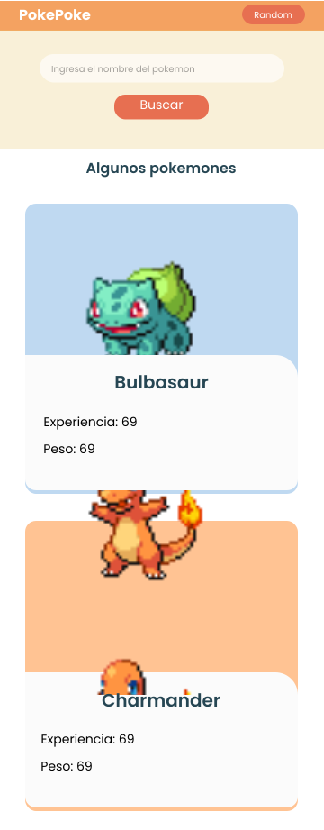
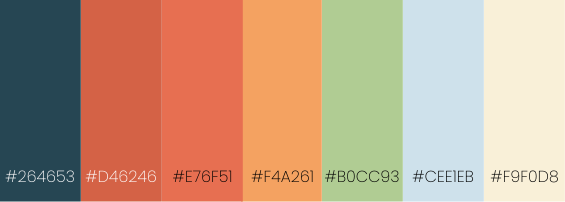

<h1 align="center">Pokedex con react</h1>

## Caracteristicas

- Consulta por id o por nombre del pokemon.
- Consulta por pokemon random desde 1 al 1010.
- La web inicializa mostrando los 9 primeros pokemones
- Diseño responsivo

## Versión demo
💻 soon...

## Tecnologias usadas

        

## Portada

## Paleta de colores

## Fuente 
- https://fonts.google.com/specimen/Poppins?query=poppins

## Autor

